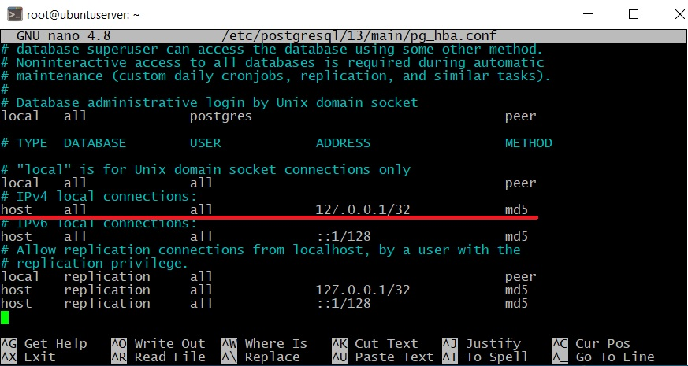

# Документация Backend части проекта Pandora CRM

## Технологии и пакеты

- Node.js > 18.0
- Bcrypt
- Nodemailer - сейчас привязан к почте yengliksalamatova@gmail.com
- express
- passport
- postgreSQL + sequelize

## Перед запуском проекта! Запуск локальной базы данных

У проекта есть два варианта запуска базы данных:

1. локальная база данных
2. через Docker - файл docker-compose.yml

Мы рассмотрим локальный запуск для того, чтобы запускать бэкап базы данных через cron.

### Установка базы данных PostgreSQL на локальной машине

Заходим на сервер:

```bash
ssh root@ip
```

Переключимся на права суперпользователя:

```bash
sudo -i
```

Установка пакета PostgreSQL 15:

```bash
sudo sh -c 'echo "deb http://apt.postgresql.org/pub/repos/apt $(lsb_release -cs)-pgdg main" > /etc/apt/sources.list.d/pgdg.list'

wget -qO- https://www.postgresql.org/media/keys/ACCC4CF8.asc | sudo tee /etc/apt/trusted.gpg.d/pgdg.asc &>/dev/null

sudo apt update
```

Установка самого пакета:

```bash
sudo apt install postgresql postgresql-client -y
```

Проверяем работает ли PostgreSQL, active - значит все работает:

```bash
systemctl status postgresql
```

Осталось создать пользователя и базу данных!
Переключаемся на пользователя postgres:

```bash
sudo -u postgres
psql ## заходим на сервер
\password postgres ## устанавливаем пароль пользователя postgres
```

Затем создаем нового пользователя на сервере PostgreSQL, так как работать от имени postgres крайне не рекомендуется.

```bash
CREATE USER info_comp WITH ENCRYPTED PASSWORD '123456';
```

где info_comp – это имя пользователя, ‘123456’ – это его пароль, Вы, соответственно, придумываете и подставляете свои данные.

Далее давайте создадим базу данных.

```bash
CREATE DATABASE test_db;
```

где test_db – это имя новой базы данных.

Теперь давайте дадим права на управление базой данных нашему новому пользователю.

```bash
GRANT ALL PRIVILEGES ON DATABASE test_db TO info_comp;
\c test_db postgres
GRANT ALL ON SCHEMA public TO info_comp;
```

Все готово, выходим из консоли.

```bash
\q
```

По умолчанию PostgreSQL прослушивает только адрес localhost, поэтому, для того чтобы мы могли подключаться по сети, нам нужно указать, какие сетевые интерфейсы будет просушивать PostgreSQL. Я для примера укажу, что прослушивать нужно все доступные интерфейсы. Если у Вас несколько сетевых интерфейсов, и Вы хотите, чтобы PostgreSQL использовал только один конкретный, то Вы его можете указать именно здесь.

Чтобы это сделать, открываем файл postgresql.conf, например, редактором nano.

    nano /etc/postgresql/13/main/postgresql.conf

Находим следующую строку.

     #listen_addresses = 'localhost'

и вносим следующие изменения (вместо звездочки Вы в случае необходимости указываете IP адрес нужного интерфейса).

    listen_addresses = '*'

Сохраняем изменения сочетанием клавиш CTRL+O и подтверждаем нажатием Enter, затем просто закрываем редактор nano сочетанием клавиш CTRL+X.

Теперь давайте разрешим подключение из сети, я для примера разрешу подключаться из сети 192.168.0.0/24 с методом аутентификации md5.

Для этого открываем файл pg_hba.conf

    nano /etc/postgresql/13/main/pg_hba.conf



```bash
  systemctl restart postgresql ## перезапускаем постгрес
```

## Запуск проекта, миграции и сидов

```bash
npm install
npx sequelize db:migrate --env production
npx sequelize db:seed:all --env production
npm run prod ## команда запуска, запускать через pm2
```

## Подготовка для запуска крон

Создание файла ~/.pgpass (для того чтобы не запрашивал пароль при плановом бэкапе)

```bash
touch ~/.pgpass
chmod 600 /.pgpass
nano ~/.pgpass
127.0.0.1:5432:test_db:test:12345
```

## Запуск крон

Для начала настроим локальное время на Алматинский:

```bash
timedatectl set-timezone Asia/Almaty
```

```bash
crontab -e
0 2 * * * /root/pandora-crm-back/backup.sh
```

Дампы будут создаваться используя скрипт backup.sh в папке проекта. Дампы находятся в папке ./backup.

## Структура папок

- server.js - подключение к БД, запуск сервера
- app.js - использование модулей, запуск подключений (route)
- /backup - папка с бэкапами после использования скрипта backup.sh, название каждого бэкапа - дата создания бэкапа
- /config - конфигурационные файлы для подключения к PostgreSQL, также там хранится сертификат для подключения (на данный момент это сертификат для Digital Ocean)
- /controllers - все основные функции взаимодействия с БД
- /middlewares - промежуточные мидлвары до основного контроллера, например проверка пользователя на то, что он является Администратором, авторизован и т.д
- /models - папка моделей для PostgreSQL
- /migrations - папка миграции для PostgreSQL
- /passport - настройки подключения для пакета passport (для авторизации)
- /routes - все основные роуты, например /api/proposals
- /seeders - сиды для PostgreSQL - сейчас там только данные администратора
- /utils - функции-помощники, конвертирование запятых в точки, отправка e-mail

## Обращение к API

Практически все обращения к API только для авторизованных пользователей, кроме логина

### User:

- /api/user/all - GET - получить данные всех пользователей, только админ
- /api/user/current - GET - получить данные текущего пользователя
- /api/user/profile/:id - GET - получить данные конкретного пользователя, только админ
- /api/user/login - POST - авторизация пользователя
- /api/user/create-user - POST - создание нового пользователя, присылает данные нового пользователя на почту, только админ
- /api/user/deactivate/:id - PATCH - деактивирует пользователя. Деактивированный пользователь больше не сможет пользоваться системой, только админ
- /api/user/activate/:id - PATCH - активирует деактивированного пользователя, только админ
- /api/user/reset-password/:id - PATCH - сброс пароля пользователя по его id, только админ
- /api/user/role/:id - PATCH - меняет роль пользователя, только админ
- /api/user/edit/:id - PATCH - меняет данные пользователя, только админ
